# Bash Scripting & Systemd Service 

The project demonstrates Linux automation skills including scripting, file operations, command-line arguments, arrays, loops, and service management.


# Overview

The project includes:

- Basic Bash scripts
- Conditional statements
- Loops
- Arrays
- File manipulation
- Error handling
- Command line arguments
- Creating and running a **Systemd service**

All tasks were completed on **Fedora Linux**.

---

# Bash Exercises

## Exercise 1 — Hello World

Simple script that prints a message.

**Script:** `ex1_hello.sh`

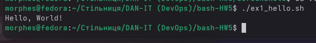

---

## Exercise 2 — User Input

Script asks the user for their name and greets them.

**Script:** `ex2_input.sh`

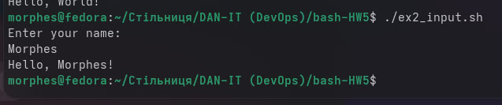

---

## Exercise 3 — Conditional Statements

Script checks whether a file exists in the current directory.

**Script:** `ex3_file_check.sh`

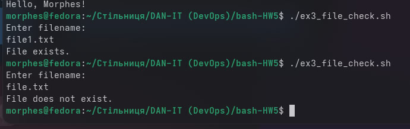

---

## Exercise 4 — Looping

Script prints numbers from **1 to 10** using a loop.

**Script:** `ex4_loop.sh`

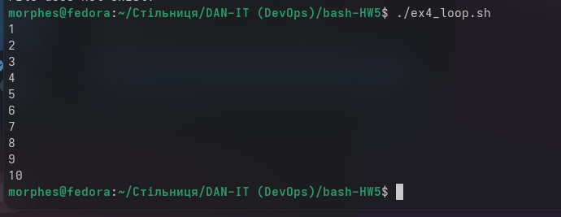

---

## Exercise 5 — File Operations

Script copies a file from one location to another using command line arguments.

Example:

```bash
./ex5_copy.sh source.txt destination.txt
```

**Script:** `ex5_copy.sh`

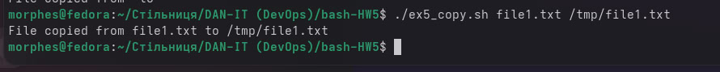

---

## Exercise 6 — String Manipulation

Script reverses the order of words in a sentence.

Example:

Input

```
Hello World
```

Output

```
World Hello
```

**Script:** `ex6_reverse.sh`

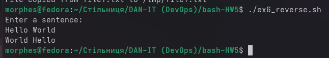

---

## Exercise 7 — Command Line Arguments

Script prints the number of lines in a file.

Example:

```bash
./ex7_lines.sh file.txt
```

**Script:** `ex7_lines.sh`

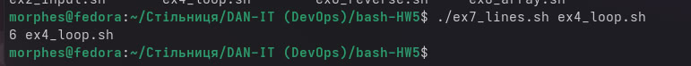

---

## Exercise 8 — Arrays

Script stores a list of fruits in an array and prints each fruit.

**Script:** `ex8_array.sh`

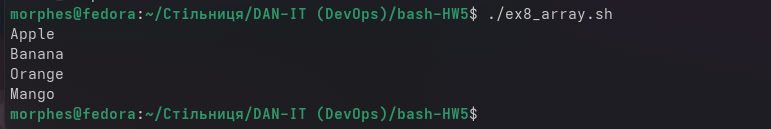

---

## Exercise 9 — Error Handling

Script attempts to read a file and handles errors properly.

If the file exists → prints its contents
If the file does not exist → displays an error message

**Script:** `ex9_error.sh`

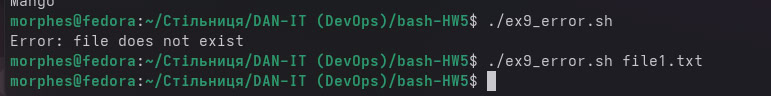

---

# Systemd Service Task

## Goal

Create a script that monitors the directory:

```
~/watch
```

When a **new file appears**, the script:

1. Prints the file contents
2. Renames the file to `.back`

---

## Monitoring Script

The script continuously checks the directory for new files.

**Script:** `watch_directory.sh`

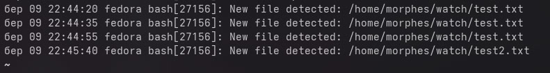

---

## Systemd Service

A **systemd service** was created to run the monitoring script automatically.

Service file location:

```
/etc/systemd/system/watch.service
```

Configuration:

```
[Unit]
Description=Watch directory service

[Service]
ExecStart=/bin/bash /home/morphes/watch_directory.sh
Restart=always
User=morphes

[Install]
WantedBy=multi-user.target
```

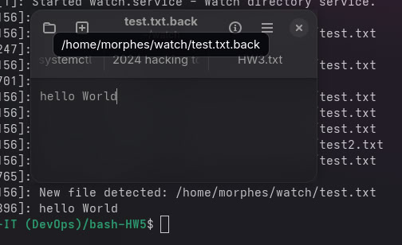

---

## Service Management

Reload systemd

```bash
sudo systemctl daemon-reload
```

Enable service

```bash
sudo systemctl enable watch.service
```

Start service

```bash
sudo systemctl start watch.service
```

Check status

```bash
systemctl status watch.service
```

---

# Project Structure

```
bash-HW5
│
├── ex1_hello.sh
├── ex2_input.sh
├── ex3_file_check.sh
├── ex4_loop.sh
├── ex5_copy.sh
├── ex6_reverse.sh
├── ex7_lines.sh
├── ex8_array.sh
├── ex9_error.sh
│
├── watch_directory.sh
├── watch.service
│
├── screenshots
│   ├── ex1.jpg
│   ├── ex2.jpg
│   ├── ex3.jpg
│   ├── ex4.jpg
│   ├── ex5.jpg
│   ├── ex6.jpg
│   ├── ex7.jpg
│   ├── ex8.jpg
│   ├── ex9.jpg
│   ├── watch.service.jpg
│   └── wath_directory.jpg
```

---

## Author 

Morphes

